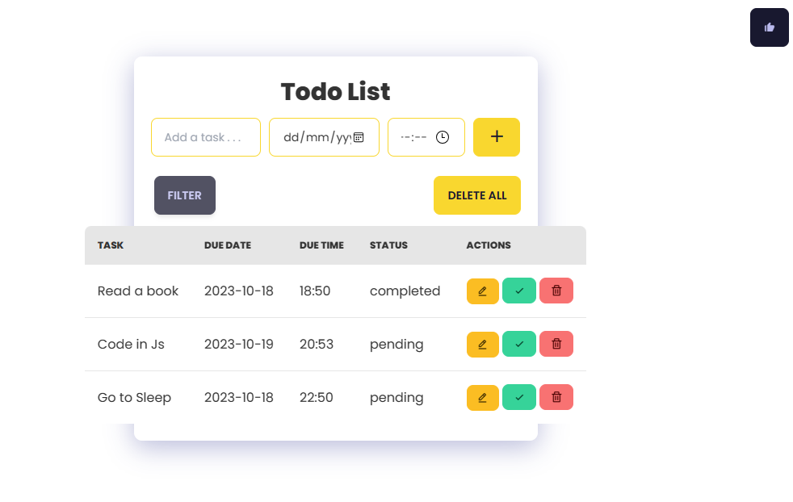

# Simple Todo List Web App Built using HTML Tailwind CSS and Javascript

This repo contains a simple Todo List web app built using HTML, Tailwind CSS and JavaScript. The app allows users to create, edit, delete and save tasks.

## Features

- Add new tasks
- Mark tasks as completed.
- Delete completed tasks or those no longer needed.
- Save tasks to the local storage for persistent data.
- Schedule your tasks
- update the task status
- Filter tasks by status i.e either pending, completed or all

## Technologies Used

- HTML5: The structure of the web app.
- CSS3 with Tailwind CSS: For styling the app.
- JavaScript: To handle the interactive functionality of the app.
- Local Storage: To save tasks for persistent data across browser sessions.

## App Apearance

## Author
- Lourdel Kigudde
